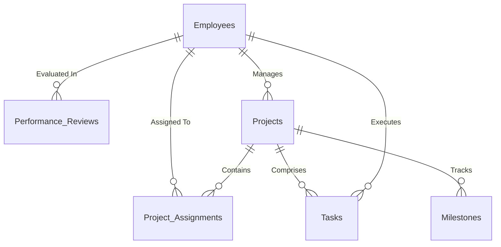

n enterprise-grade, interactive **Power BI Dashboard** developed for **TechCorp** to monitor project portfolios, track sprint and task execution, manage budget allocations, and analyze employee performance.

---

## 📌 Executive Summary

The **TechCorp Task & Project Allotment Dashboard** bridges the gap between project management, resource allocation, and HR analytics. Built on a 6-table relational dataset, this report empowers executives, project managers, and HR leaders to make data-driven decisions regarding resource utilization, budget efficiency, sprint productivity, and workforce development.

### 🌟 Key Highlights
- **5 Comprehensive Dashboard Pages** for multi-level organizational analysis.
- **Real-Time Financial & Budget Tracking** (Budget vs. Actual Cost analysis).
- **Sprint & Delivery Performance** tracking estimated vs. actual effort hours.
- **Resource & Workload Management** across 30 active employees and 8 departments.
- **HR Analytics & Performance Reviews** including goal achievement rates and promotion recommendations.
- **Sleek Dark Mode UI** (`#070707` background) with custom visual indicators, KPI cards, and smooth navigation.

---

## 🖥️ Dashboard Overview & Page Structure

### 1. 🏠 Home Page (`Home`)
- **Purpose**: Serves as the executive landing hub providing immediate insights into organizational health and navigation across report sections.
- **Key Visuals**:
  - Top KPI cards displaying key summary metrics.
  - **Tasks by Priority** (Column Chart & Gauge Visual).
  - High-level project and task breakdown table.
  - Interactive slicers for rapid filtering.

---

### 2. 📊 Executive Summary Page (`Executive Summary`)
- **Purpose**: Provides C-level management with portfolio-level visibility into financial budgets, project status, and manager performance.
- **Key Visuals**:
  - **Budget vs Actual Cost by Category**: Clustered Bar Chart comparing financial allocations across categories (Digital Transformation, Mobile App, Infrastructure, etc.).
  - **Projects by Status**: Donut Chart tracking projects across statuses (`In Progress`, `Completed`, `Planning`, `On Hold`, `Cancelled`).
  - **Project by Priority**: Column Chart highlighting project distribution by priority level (`Critical`, `High`, `Medium`, `Low`).
  - **Project by Manager**: Horizontal Bar Chart visualizing project count per manager.
- **Interactive Slicers**: `Completed Month`, `Project Category`, `Status`.

---

### 3. 📁 Project Portfolio Page (`Project Portfolio`)
- **Purpose**: Deep dives into client accounts, project management efficiency, and team allocations.
- **Key Visuals**:
  - **Projects by Client**: Donut Chart showing client distribution (`TechGiant Ltd`, `EduTech`, `FinServe Inc`, `Acme Corp`, etc.).
  - **Project by Manager**: Manager project allocation breakdown.
  - **Average Performance of Manager**: Bar Chart evaluating manager performance scores.
  - **Tasks by Priority & Details**: Comprehensive table matrix mapping tasks to project priorities.

---

### 4. ⚡ Task & Delivery Page (`Task & Delivery`)
- **Purpose**: Designed for Agile Project Managers and Delivery Leads to monitor sprint velocity, task bottlenecks, and effort estimation accuracy.
- **Key Visuals**:
  - **Sprint wise Estimated vs Actual Hours**: Line Chart comparing estimated effort hours against actual burn-down hours across Sprints (Sprint 1 to Sprint 6).
  - **Tasks by Sprint**: Column Chart tracking workload per sprint.
  - **Tasks by Employee**: Bar Chart showing task distribution across individual team members.
  - **Projects by Status**: Donut visual summarizing active delivery statuses.
  - **Tasks Details Matrix**: Granular task-level grid (`TaskID`, `Sprint`, `Estimated vs Actual Hours`, `Status`, `Tags`).

---

### 5. 👥 HR & Performance Page (`HR & Performance`)
- **Purpose**: Enables HR Leadership and Department Heads to evaluate workforce productivity, attendance, goal completions, and promotion readiness.
- **Key Visuals**:
  - **Top Employee by Performance Score**: Clustered Bar Chart showcasing top-performing employees.
  - **Employees by Attendance Score**: Clustered Bar Chart evaluating employee attendance compliance.
  - **Goal Achieved VS Goal Set**: Gauge Visual tracking percentage of organizational goals met.
  - **Promotion Recommended**: Donut Chart displaying the ratio of employees recommended for promotion vs non-eligible staff.
  - **Performance Evaluation Grid**: Detailed matrix mapping ratings (`Excellent`, `Good`, `Average`), salary increase percentages, and reviewer comments.

---

## 🗃️ Data Model & Schema Architecture

The dashboard is powered by the `TechCorp_PowerBI_Dataset.xlsx` dataset, modeled in Power BI using a **Star/Snowflake Schema** centered around task execution and employee assignments.



### 📋 Table Details

| Table Name | Record Count | Key Fields | Description |
| :--- | :---: | :--- | :--- |
| **`Employees`** | 30 | `EmployeeID`, `FullName`, `Department`, `Designation`, `AnnualSalary`, `ManagerID`, `Location` | Master table storing employee demography, salaries, and hierarchy. |
| **`Projects`** | 15 | `ProjectID`, `ProjectName`, `Category`, `Status`, `Priority`, `Budget`, `ActualCost`, `CompletionPct`, `ClientName` | Portfolio details, financial budget allocation, and completion status. |
| **`Project_Assignments`** | 78 | `AssignmentID`, `ProjectID`, `EmployeeID`, `Role`, `AllocationPct`, `IsActive` | Bridge table connecting employees to active projects with role allocations. |
| **`Tasks`** | 189 | `TaskID`, `ProjectID`, `TaskName`, `AssignedTo`, `Status`, `Priority`, `EstimatedHours`, `ActualHours`, `Sprint`, `Tags` | Granular task backlog tracking sprint effort, status, and completion. |
| **`Performance_Reviews`** | 60 | `ReviewID`, `EmployeeID`, `ReviewYear`, `PerformanceScore`, `GoalsAchieved`, `GoalsSet`, `AttendanceScore`, `PromotionRecommended` | Annual & quarterly performance evaluation scores and compensation updates. |
| **`Milestones`** | 65 | `MilestoneID`, `ProjectID`, `MilestoneName`, `PlannedDate`, `ActualDate`, `Status` | Critical project milestone deliverables and timeline variance. |

---

## 🧮 DAX Measures & Analytics Logic

Key DAX measures defined in the model to drive dynamic visual KPIs:

### 🎯 Project & Financial Metrics
- **Total Projects**:
  ```dax
  Total Projects = COUNTROWS('Projects')
  ```
- **Completed Projects**:
  ```dax
  Completed Project = CALCULATE(COUNTROWS('Projects'), 'Projects'[Status] = "Completed")
  ```
- **Projects In Progress**:
  ```dax
  In Progress = CALCULATE(COUNTROWS('Projects'), 'Projects'[Status] = "In Progress")
  ```
- **Total Budget**:
  ```dax
  Total Budget = SUM('Projects'[Budget])
  ```
- **Total Actual Cost**:
  ```dax
  Total Actual Cost = SUM('Projects'[ActualCost])
  ```
- **Budget Variance**:
  ```dax
  Budget Variance = SUM('Projects'[Budget]) - SUM('Projects'[ActualCost])
  ```

---

### ⚡ Task & Delivery Metrics
- **Total Tasks**:
  ```dax
  Total Tasks = COUNTROWS('Tasks')
  ```
- **Completed Tasks**:
  ```dax
  Completed Task = CALCULATE(COUNTROWS('Tasks'), 'Tasks'[Status] = "Done")
  ```
- **In Review Tasks**:
  ```dax
  In Review Task = CALCULATE(COUNTROWS('Tasks'), 'Tasks'[Status] = "In Review")
  ```
- **Pending / In Progress Tasks**:
  ```dax
  Pending Task = CALCULATE(COUNTROWS('Tasks'), 'Tasks'[Status] IN {"In Progress", "To Do", "Blocked"})
  ```
- **Critical Tasks**:
  ```dax
  CriticalTask = CALCULATE(COUNTROWS('Tasks'), 'Tasks'[Priority] = "Critical")
  ```
- **Estimated vs Actual Hours Variance**:
  ```dax
  Hours Variance = SUM('Tasks'[ActualHours]) - SUM('Tasks'[EstimatedHours])
  ```

---

### 👥 HR & Performance Metrics
- **Total Employees**:
  ```dax
  Total Employees = COUNTROWS('Employees')
  ```
- **Total Managers**:
  ```dax
  Total Managers = DISTINCTCOUNT('Projects'[ProjectManagerID])
  ```
- **Average Performance Score**:
  ```dax
  Avg Performance Score = AVERAGE('Performance_Reviews'[PerformanceScore])
  ```
- **Goal Completion Rate %**:
  ```dax
  Goal Completion Rate % = DIVIDE(SUM('Performance_Reviews'[GoalsAchieved]), SUM('Performance_Reviews'[GoalsSet]), 0)
  ```

---

## 🎨 Design & Theme Specifications

- **Color Palette**:
  - **Background**: `#070707` (Deep Dark Theme for reduced eye strain)
  - **Cards & Visual Containers**: `#161616` / High Contrast Glassmorphism
  - **Primary Accent**: Gold / Amber `#F2C811`
  - **Secondary Accent**: Electric Blue `#00D2FF`
  - **Status Indicators**:
    - 🟢 Completed / Done: Green
    - 🟡 In Progress / Review: Amber / Cyan
    - 🔴 Critical / Blocked / Delayed: Bright Crimson Red
- **Icons & Assets**: Custom SVG & PNG visual indicators for sprint clock, checklist, users, report, and automation.

---

## 📂 Repository Structure

```directory
Task Allotment/
│
├── Task - Dashboard.pbix                 # Core Power BI Report File
├── README.md                             # Repository Documentation
│
├── Datatset-20260722T044936Z-1-001/
│   └── Datatset/
│       └── TechCorp_PowerBI_Dataset.xlsx # Data Source Workbook (6 Sheets)
│
├── Images/                               # Custom UI Assets & Icon Set
│   ├── background_color_will_be_#070707_202606040040.png
│   ├── automation.png
│   ├── businessman (3).png
│   ├── check-list.png
│   ├── clock.png
│   ├── perfomance.png
│   ├── report.png
│   └── ... (37 custom UI icons)
│
└── screenshots/                          # Dashboard Page Captures
```

---

## ⚙️ How to Setup & Run

### Prerequisites
1. **Microsoft Power BI Desktop** (Latest Version recommended).
2. **Microsoft Excel** (To view or edit the underlying dataset).

### Steps to Launch
1. **Clone the Repository**:
   ```bash
   git clone https://github.com/your-username/techcorp-powerbi-dashboard.git
   cd techcorp-powerbi-dashboard
   ```
2. **Open the Report**:
   - Double-click `Task - Dashboard.pbix` to launch in Power BI Desktop.
3. **Update Data Source Path** (If required):
   - If prompted for missing file paths:
     1. Click **Transform Data** -> **Data source settings**.
     2. Select `TechCorp_PowerBI_Dataset.xlsx` and click **Change Source**.
     3. Browse to `./Datatset-20260722T044936Z-1-001/Datatset/TechCorp_PowerBI_Dataset.xlsx` in your local directory.
     4. Click **Apply Changes & Refresh**.

---

## 🚀 Future Roadmap & Enhancements

- [ ] **Power BI Service Deployment**: Publish report to Power BI Workspace with scheduled gateway data refresh.
- [ ] **Row-Level Security (RLS)**: Configure role-based data security for Project Managers to view only their assigned projects.
- [ ] **Live Jira / Azure DevOps Integration**: Replace static Excel data source with direct REST API connector to Jira/Azure DevOps backlogs.
- [ ] **Automated Email Alerts**: Set up Power Automate data alerts for critical project delays or budget overruns.

---

